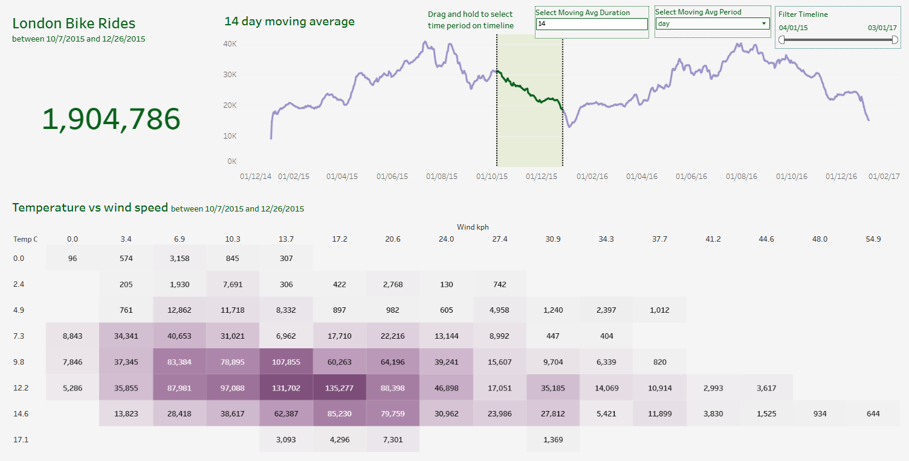

# Data Analytics With Python and Tableau

This project demonstrates a complete end-to-end data analytics process, encompassing data collection, cleaning, analysis, visualization, and presentation.

## Project Overview

- **Objective**: To analyze a dataset to uncover meaningful insights and present them effectively.
- **Dataset**: For this project dataset is derived from Kaggle for analytics purpose
- **Tools Used**: To analyze and extract data from the dataset, Utilized Python, Jupyter notebook, Pandas, Tableau, Kaggle API, CSV

## Project Steps

1. **Data Collection**: Gathered data from Kaggle, ensuring relevance and quality.
2. **Data Cleaning**: Handled missing values, removed duplicates, and corrected inconsistencies to prepare the data for analysis.
3. **Data Analysis**: Performed exploratory data analysis to identify patterns and correlations.
4. **Data Visualization**: Created visual representations of the data to highlight key findings.
5. **Presentation**: Compiled the analysis and visualizations into a coherent report/dashboard for stakeholders.

## Dashboard

## Conclusion

This project exemplifies the application of data analytics techniques to derive actionable insights from raw data, showcasing proficiency in the entire data analysis pipeline.

